# Qwen animation summary

Can a **local Qwen** write good 3D animations for a real website? This repo documents one day of experiments
(2026-09-25) on the hero section of a small 3D-printing / reverse-engineering shop website (not public yet): a three.js
scene where a 3D printer prints a model layer by layer, and after printing the model "comes alive" (a robot waves,
a rocket takes off, a bee flies around a tree…).

Local LLMs (Qwen 3.6-27B, Qwen 3.8-27B, Qwen 3.8 Flash-Next, Bonsai 2) were asked to write those animations as small
JavaScript modules and were compared with **Claude Opus 5.5**. Along the way we measured speculative decoding
(MTP / DFlash / DSpark, draft length `n`, `--spec-draft-p-min`) on a single RTX 3090.

**Short version**

- **Claude Opus 5.5 won on all four models** (robot, rocket, bee, cactus), judged by the site owner's eye.
- Local Qwen went from "unusable" to "often good" mostly because of **better information and tooling**, not a
  bigger model: named part boxes, nested parts, a real-three.js validator and fixes to our own host bugs.
- **Thinking level matters:** Qwen 3.8 `medium` gave the best results; `xhigh` over-thinks (2–5× slower, invents
  shortcuts that break the result), `low` is fast but cuts corners (twitching wings).
- **Speculative decoding:** `--spec-draft-p-min` matters more than the draft length. With `p-min 0.65`,
  **DFlash n7** is the fastest for both models: Qwen 3.8 **43.2 t/s thinking / 71.5 t/s code** (vs 30 / 30 without
  speculation), Qwen 3.6 **40.7 / 56.2** (vs 25 / 27). DSpark was the weakest.
- Giving Qwen **"eyes"** (rendered frames + a motion chart) let it catch and fix some visual bugs by itself, but not all.

> Code comments in `tools/` are partly in Lithuanian (the project language); the README and prompts are English.

---

## Hardware and software

| | |
|---|---|
| GPUs | 2× NVIDIA RTX 3090 24 GB (GPU0 also drives the Windows desktop) |
| RAM / OS | 128 GB, Windows 10 |
| Runtime | llama.cpp **b11037** (commit `44be98f05`), native Windows CUDA build, `llama-server` (OpenAI-compatible API) |
| Qwen 3.8 | `Qwen3.8-27B-UD-IQ4_XS.gguf` (14.3 GB, built-in MTP head `blk.64.nextn.*`) |
| Qwen 3.6 | `Qwen3.6-27B-UD-Q4_K_XL.gguf` (17.9 GB, built-in MTP head) · first comparison used `Qwen3.6-27B-IQ4_XS.gguf` (no MTP) |
| Draft models | `Qwen3.8-27B-DFlash2-Q8_0.gguf` (z-lab, latest DFlash for 3.8) · `Qwen3.6-27B-DFlash-Q8_0.gguf` · `Qwen3.8-27B-DSpark-Q8_0.gguf` |
| Vision | `Qwen3.8-27B-mmproj-F16.gguf`, `Qwen3.6-27B-mmproj-F16.gguf` (for the "eyes" loop) |
| Other LLMs (first comparison) | Qwen 3.8 Flash-Next IQ4_XS (177B MoE), Ternary-Bonsai-2-27B (1.58-bit Qwen 3.8, PrismML llama.cpp fork) |

### Downloads — exact files used

**llama.cpp** — release **b11037** (2026-09-18), Windows CUDA 13.4 build:
[`llama-b11037-bin-win-cuda-13.4-x64.zip`](https://github.com/ggml-org/llama.cpp/releases/download/b11037/llama-b11037-bin-win-cuda-13.4-x64.zip)
+ [`cudart-llama-bin-win-cuda-13.4-x64.zip`](https://github.com/ggml-org/llama.cpp/releases/download/b11037/cudart-llama-bin-win-cuda-13.4-x64.zip)
(unzip both into one folder). Release page: <https://github.com/ggml-org/llama.cpp/releases/tag/b11037>.
Linux/macOS: build the same tag from source (`git checkout b11037`, `cmake -DGGML_CUDA=ON`).

**GGUF files** (sizes are exact; the Unsloth files match ours byte for byte):

| Role | File | Size | Source (Hugging Face) |
|---|---|---:|---|
| Qwen 3.8 main model | `Qwen3.8-27B-UD-IQ4_XS.gguf` | 14.25 GB | [unsloth/Qwen3.8-27B-GGUF](https://huggingface.co/unsloth/Qwen3.8-27B-GGUF) (Unsloth Dynamic quant of [Qwen/Qwen3.8-27B](https://huggingface.co/Qwen/Qwen3.8-27B)) |
| Qwen 3.8 vision | `mmproj-F16.gguf` (we renamed it `Qwen3.8-27B-mmproj-F16.gguf`) | 0.93 GB | [unsloth/Qwen3.8-27B-GGUF](https://huggingface.co/unsloth/Qwen3.8-27B-GGUF) |
| Qwen 3.8 draft · **DFlash2** | `Qwen3.8-27B-DFlash2-Q8_0.gguf` | 2.06 GB | [z-lab/Qwen3.8-27B-DFlash2-GGUF](https://huggingface.co/z-lab/Qwen3.8-27B-DFlash2-GGUF) (original: [z-lab/Qwen3.8-27B-DFlash2](https://huggingface.co/z-lab/Qwen3.8-27B-DFlash2); latest z-lab DFlash for 3.8) |
| Qwen 3.8 draft · DSpark | `Qwen3.8-27B-DSpark-Q8_0.gguf` | 1.46 GB | [magnitudedev/Qwen3.8-27B-DSpark-GGUF](https://huggingface.co/magnitudedev/Qwen3.8-27B-DSpark-GGUF) (GGUF of [RadixArk/Qwen3.8-27B-DSpark](https://huggingface.co/RadixArk/Qwen3.8-27B-DSpark)) |
| Qwen 3.6 main model | `Qwen3.6-27B-UD-Q4_K_XL.gguf` | 17.61 GB | [unsloth/Qwen3.6-27B-GGUF](https://huggingface.co/unsloth/Qwen3.6-27B-GGUF) (of [Qwen/Qwen3.6-27B](https://huggingface.co/Qwen/Qwen3.6-27B)) |
| Qwen 3.6 main model (1st comparison) | `Qwen3.6-27B-IQ4_XS.gguf` | 15.44 GB | [unsloth/Qwen3.6-27B-GGUF](https://huggingface.co/unsloth/Qwen3.6-27B-GGUF) — no MTP head |
| Qwen 3.6 vision | `mmproj-F16.gguf` (renamed `Qwen3.6-27B-mmproj-F16.gguf`) | 0.93 GB | [unsloth/Qwen3.6-27B-GGUF](https://huggingface.co/unsloth/Qwen3.6-27B-GGUF) |
| Qwen 3.6 draft · **DFlash** | `Qwen3.6-27B-DFlash-Q8_0.gguf` | 1.85 GB | Q8_0 GGUF of [z-lab/Qwen3.6-27B-DFlash](https://huggingface.co/z-lab/Qwen3.6-27B-DFlash), e.g. [Ardenzard/Qwen3.6-27B-DFlash-GGUF](https://huggingface.co/Ardenzard/Qwen3.6-27B-DFlash-GGUF) (community conversion; ours differs only in a few hundred bytes of metadata) |

MTP needs no extra file — both main GGUFs keep Qwen's built-in MTP head (`blk.64.nextn.*`, `nextn_predict_layers = 1`).
Example download: `hf download unsloth/Qwen3.8-27B-GGUF Qwen3.8-27B-UD-IQ4_XS.gguf mmproj-F16.gguf --local-dir models`.

### KV cache and context

| Setting | Value |
|---|---|
| KV cache type | **`q8_0` for both K and V** (`-ctk q8_0 -ctv q8_0`), flash attention on (`-fa on`) |
| Draft model KV cache | llama.cpp default (f16) |
| Context | **49 152** tokens for animation runs (thinking + up to 4 repair rounds; peak use 24k) · 16 384 for speed benchmarks · 32 768 for GPU0 runs of Qwen 3.6 (to fit next to the desktop) |
| VRAM (one 3090, final setup with vision) | Qwen 3.8 ≈ 19.6 GB · Qwen 3.6 ≈ 23.4 GB |

Both models are hybrid (Gated DeltaNet + sparse attention), so the KV cache only grows on the few full-attention layers
and a 48k context costs little VRAM.

### What do you need?

| Goal | Needs |
|---|---|
| Just run the model the same way | llama.cpp b11037 + the GGUF files + `tools/start_qwen38.bat` (or `start_qwen36.bat`). **No Python.** |
| Repeat the speed benchmark | + Python 3.9+ (`tools/bench_spec.py`, standard library only; edit the model paths at the top) |
| Generate animations like we did | + Python (`numpy`, `Pillow`, `matplotlib`) + Node.js (`npm install` in `tools/` → `three`, `puppeteer-core`) + Chrome + a three.js page implementing the host API (`host/anim-host-excerpt.js`) |

The Python/Node scripts are the experiment's pipeline (prompting, validation, "eyes", gallery). They are published so
the results can be checked and reproduced; you don't need them to use the models.

### GPU usage — one RTX 3090 per model

- **Every model instance ran on a single RTX 3090** (`CUDA_VISIBLE_DEVICES=1` or `0`); no 27B model was ever split
  across both cards.
- **All speed benchmarks** (section 1) ran **only on GPU1** — the second GPU was not used for them at all.
- To save wall-clock time, some **animation-generation runs** were two *independent* jobs at once, one model per GPU
  (e.g. Qwen 3.8 `medium` on GPU1 and `low` on GPU0). Each job still used exactly one 3090, so results are per-GPU.
- The only exception is **Qwen 3.8 Flash-Next** in the first comparison: a 177B MoE that needs both cards plus CPU RAM.

---

## 1. Speed — speculative decoding on one RTX 3090

**Method** (`tools/bench_spec.py`): `llama-server` on GPU1 with `-c 16384 -fa on -ctk q8_0 -ctv q8_0 --parallel 1
--jinja --top-p 0.95 --top-k 20 --min-p 0`, request `temperature 1.0`. Two tasks, each run twice and averaged:
**code** (a three.js animation module, 700 tokens, thinking off) and **thinking** (planning an animation, 1500 tokens,
thinking on). In the animation runs ~90 % of generated tokens are *thinking*, so that column matters most.
`n` = `--spec-draft-n-max` (llama.cpp default **3**). "Accepted" = accepted / drafted tokens while thinking.
Thinking speed varies about **±5 % between runs**, so compare rows measured in the same batch.

### Qwen 3.6-27B (UD-Q4_K_XL)

| Speculation | Code t/s | Thinking t/s | Thinking vs none | Accepted |
|---|---:|---:|---:|---:|
| none | 27.2 | 25.1 | — | — |
| MTP n4 | 44.4 | 37.6 | +50 % | 49 % |
| DFlash n3 (default n) | 44.6 | 38.7 | +54 % | 55 % |
| DFlash n7 | 46.3 | 31.0 | +24 % | 30 % |
| DFlash n7 + p-min 0.6 | 51.3 | 40.8 | +63 % | 81 % |
| **DFlash n7 + p-min 0.65** | **56.2** | **40.7** | **+62 %** | 86 % |
| DFlash n7 + p-min 0.7 | 46.0 | 40.1 | +60 % | 87 % |
| DSpark n7 + p-min 0.65 | 39.0 | 30.9 | +23 % | 86 % |
| DSpark n7 + p-min 0.7 | 32.5 | 30.1 | +20 % | 87 % |

### Qwen 3.8-27B (UD-IQ4_XS)

| Speculation | Code t/s | Thinking t/s | Thinking vs none | Accepted |
|---|---:|---:|---:|---:|
| none | 30.4 | 30.0 | — | — |
| MTP n4 (2 runs) | 66.9 | 38.3 | +28 % | 34–37 % |
| MTP n5 | 64.2 | 32.2 | +7 % | 26 % |
| MTP n6 | 65.0 | 29.3 | −2 % | 23 % |
| MTP n4 + p-min 0.6 | 70.0 | 42.1 | +40 % | 62 % |
| MTP n4 + p-min 0.65 | 66.6 | 44.1 | +47 % | 70 % |
| MTP n4 + p-min 0.7 | 63.7 | 43.4 | +45 % | 72 % |
| MTP n6 + p-min 0.6 | 67.8 | 41.3 | +38 % | 58 % |
| DFlash2 n3 (default n) | 64.2 | 41.3 | +38 % | 41 % |
| DFlash2 n4 + p-min 0.65 | 69.2 | 39.7 | +32 % | 71 % |
| DFlash2 n7 + p-min 0.6 | 72.7 | 41.0 | +37 % | 58 % |
| **DFlash2 n7 + p-min 0.65** (2 runs) | **71.5** | **43.2** | **+44 %** | 64–71 % |
| DFlash2 n7 + p-min 0.7 | 68.3 | 37.7 | +26 % | 69 % |
| DSpark n3 | 55.2 | 35.9 | +20 % | 29 % |
| DSpark n7 + p-min 0.65 | 49.3 | 32.7 | +9 % | 78 % |
| DSpark n7 + p-min 0.7 | 47.9 | 32.9 | +10 % | 88 % |

**Findings**

- **Without `p-min`, longer drafts hurt thinking** (MTP n4 → n6: 38.3 → 29.3 t/s): on varied text the tail of a long
  draft is usually rejected, and every rejected token is wasted work. On code (predictable) longer drafts help a little.
- **`--spec-draft-p-min` defaults to 0**, i.e. the drafter always drafts all `n` tokens even when unsure. With
  **`p-min 0.65`** drafting stops when confidence drops, so a long `n` no longer hurts and **DFlash n7** becomes the best
  on both models. `0.7` already cuts too much (DFlash2 n7: 43 → 38 t/s thinking).
- **DSpark** (RadixArk's draft model *for Qwen 3.8*) is the weakest on both models and gets *slower* with `p-min`
  (its confidence seems poorly calibrated: very high acceptance %, but only a few tokens per step). In relative terms it
  helps Qwen 3.6 more (+23 %) than Qwen 3.8 (+9 %) — mostly because Qwen 3.6 is slower without speculation.
- The high "accepted %" rows with `p-min` are not directly comparable to rows without it — fewer tokens are drafted.

### Final launch commands (`tools/start_qwen38.bat`, `tools/start_qwen36.bat`)

```bat
set CUDA_VISIBLE_DEVICES=1
llama-server.exe -m Qwen3.8-27B-UD-IQ4_XS.gguf --mmproj Qwen3.8-27B-mmproj-F16.gguf ^
  -ngl 99 -c 49152 -fa on -ctk q8_0 -ctv q8_0 ^
  --spec-type draft-dflash -md Qwen3.8-27B-DFlash2-Q8_0.gguf -ngld 99 ^
  --spec-draft-n-max 7 --spec-draft-p-min 0.65 ^
  --top-p 0.95 --top-k 20 --min-p 0.0 ^
  --reasoning-budget 12000 --reasoning-budget-message "Thinking time is up. Now write the final module in exactly one js code block." ^
  --parallel 1 --no-warmup --jinja --port 1234
```

Qwen 3.6: the same with `Qwen3.6-27B-UD-Q4_K_XL.gguf`, `Qwen3.6-27B-mmproj-F16.gguf` and
`-md Qwen3.6-27B-DFlash-Q8_0.gguf`. VRAM on the single GPU: Qwen 3.8 ≈ 19.6 GB, Qwen 3.6 ≈ 23.4 GB.

| Flag | Why |
|---|---|
| `-ngl 99` | all layers on the GPU (27B at ~4 bit fits in 24 GB) |
| `-c 49152` | thinking + repair rounds need room (largest request seen: 24k tokens) |
| `-fa on -ctk q8_0 -ctv q8_0` | flash attention, 8-bit KV cache (half the VRAM, no visible loss) |
| `--spec-type draft-dflash -md … -ngld 99` | DFlash block drafter on the same GPU |
| `--spec-draft-n-max 7 --spec-draft-p-min 0.65` | long drafts, but stop when the drafter is unsure |
| `--top-p 0.95 --top-k 20 --min-p 0` | Qwen's recommended sampling for thinking (request sends `temperature 1.0`) |
| `--reasoning-budget 12000` + message | `xhigh` thinking otherwise runs 15–25k tokens and hits the answer limit before writing code |
| `--jinja` | the model's own chat template (thinking switch, `reasoning_effort`) |
| `--parallel 1` | one request at a time (fastest for a single user) |
| `--mmproj` | vision — needed only for the "eyes" loop |

Per request (`tools/qwen_anim.py`): `max_tokens 20000`, `chat_template_kwargs: {enable_thinking: true,
reasoning_effort: "medium"}`. Qwen 3.8's template supports `low` / `medium` / `xhigh` (default when unset: **xhigh**);
Qwen 3.6's template has no levels, so `--inject-effort low|xhigh` prepends Qwen 3.8's level sentence to the system prompt.

---

## 2. How the animations are made

```
idea (text) ─► qwen_anim.py ─► LLM (llama-server) ─► JS module ─► validate.mjs (real three.js) ─┐
                    ▲                                                                              │
                    └──────── validator errors / "eyes": frames + motion chart ◄──────────────────┘
```

- **Host API** (`host/anim-host-excerpt.js`): each model's animation is a module
  `export default { setup(ctx), update(ctx), reset(ctx) }`. `ctx.e` = seconds since printing finished (animate
  1.7–6.6 s, rest by 7 s), `ctx.group`, `ctx.extra`, `ctx.light`, `ctx.mats` and **`ctx.split(test, {pivot, parent})`**,
  which cuts triangles (selected by relative box coordinates `u/v/w`) into a separately movable part with a hinge.
- **Prompt** (`tools/SYSTEM_PROMPT.md`): timeline rules, the ctx reference, rotation conventions, craft rules and a
  checklist, plus two verified example animations written by Claude (`animations/claude/robot.js`, `rocket.js`).
- **Named parts** (`tools/parts.json`): exact boxes of each part (e.g. the bee's wings vs. its body), converted to
  `u/v/w` and sent with the model's Python build source.
- **Validator** (`tools/validate.mjs`): runs the module in node with real three.js and the same `ctx` as the site;
  checks errors, NaN, rest pose during printing/support removal, return to rest by 7 s (rotations modulo 2π),
  leftover effects, material changes, speed. Errors are fed back to the LLM (up to 3 repair rounds).
- **"Eyes"** (`tools/look.py`, `tools/capture.mjs`): a headless Chrome renders the real page (RTX 3090, D3D11)
  at 8 moments → one frame sheet, plus a motion chart from the validator's per-frame transforms and automatic notes
  ("very fast rotation … ~363° turned"). Both images go to the LLM; it replies `LOOKS_GOOD` or fixes the code.
- **Retries**: every round resends the whole conversation (prompt + previous code + validator/eyes feedback).
  Thinking is *not* sent back, so the prompt grows by only ~1.6–2.1k tokens per round (≈24k of 48k at most).

---

## 3. Quality — first comparison (4 models, no thinking)

Same ideas for robot (wave), rocket (take-off + landing), voxel island (bee flies around the tree) and voxel cactus
(explodes and reassembles); the LLM did not see Claude's solution for the same model. Temperature 0.4, thinking off.

| LLM | robot | rocket | bee | cactus | Owner's verdict |
|---|---|---|---|---|---|
| **Claude Opus 5.5** | ✓ | ✓ | ✓ | ✓ | **best in all four** |
| Qwen 3.8-27B | ✓ 1 | ✓ 2 | ⚠ 4 | ✓ 1 | tried more, mostly not successful |
| Qwen 3.8 Flash-Next (2 GPUs) | ✗→✓ 2nd run | ✓ 3 | ✓ 1 | ✓ 1 | a bit worse than Qwen 3.8 |
| Qwen 3.6-27B | ✓ 2 | ✓ 2 | ✓ 2 | ✓ 1 | weak |
| Bonsai 2 (ternary 27B) | ⚠ 4 | ✓ 2nd run | ⚠ 4 | ✓ 1 | nothing good |

(number = attempts until the validator accepted; ⚠ = saved with warnings)

---

## 4. Quality — the bee, with thinking

After the first comparison we improved the setup (named parts, nested parts, fixed host bugs) and focused on one hard
task: *"The bee sits on top of the tree. Its wings start flapping fast, it takes off, flies a circle around the tree
and lands back in the same spot."* All rows below use the improved setup and a 12k thinking budget unless noted.
**Verdict = the site owner's visual judgement**; frames were rendered from the real page.

| Model and thinking level | Rounds | Time | Verdict |
|---|---:|---:|---|
| [Claude Opus 5.5](#claude-opus-55) | — | — | **best** |
| [Qwen 3.8 · medium](#qwen-38--medium) | 1 | 4.5 min | **looks good** |
| [Qwen 3.6 · natural thinking (≈ medium)](#qwen-36--natural-thinking) | 1 | 5.0 min | **best motion in space**, but a sudden 360° spin before landing* |
| [Qwen 3.8 · xhigh v2](#qwen-38--xhigh-v2) | 3 | 25 min | good, but took a chunk of the treetop* |
| [Qwen 3.8 · no thinking](#qwen-38--no-thinking) | 4 | ~3 min | good, only a timid flight |
| [Qwen 3.8 · medium + eyes](#qwen-38--medium--eyes) | 3 | 5.8 min | almost — fixed its own too-fast wings, but doesn't circle the tree |
| [Qwen 3.6 · + eyes](#qwen-36---eyes) | 4 | 12.4 min | almost — fixed its own out-of-phase wings |
| [Qwen 3.6 · injected low](#qwen-36--injected-low) | 1 | 3.5 min | moves fairly well, weak wings |
| [Qwen 3.8 · low](#qwen-38--low) | 1 | 3.5 min | ✗ twitching wings |
| [Qwen 3.8 · xhigh v3](#qwen-38--xhigh-v3) | 2 | 7.6 min | ✗ the bee opens like a book |
| [Qwen 3.8 · xhigh v1](#qwen-38--xhigh-v1) (before named parts) | 2 | 17 min | ✗ the bee flies in pieces |

\* caused by *our* host/validator, since fixed: the part box was computed in world space while the print bed
rotates (u/w shifted), and the validator demanded rotation exactly 0 at 7 s (forcing models to "unwind" a full turn).

### Gallery — where the problems are visible

Frame sheets: 8 moments `e` = seconds after printing (orange labels). Motion charts: position (left) and rotation
(right) of the whole model and every split part over time; grey = supports being removed, dotted = 6.6 s,
red = rotation faster than 720 °/s.

#### Claude Opus 5.5
Reference. The bee lifts off, circles the tree with banking and flapping wings, lands in place.
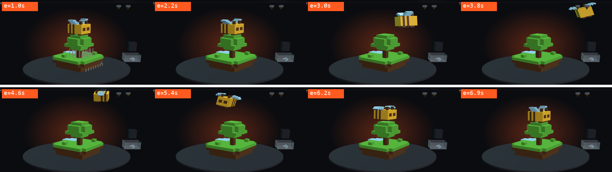

#### Qwen 3.8 · medium
Clean take-off, flight and landing; wings attached and flapping steadily (±29°). Became the default.
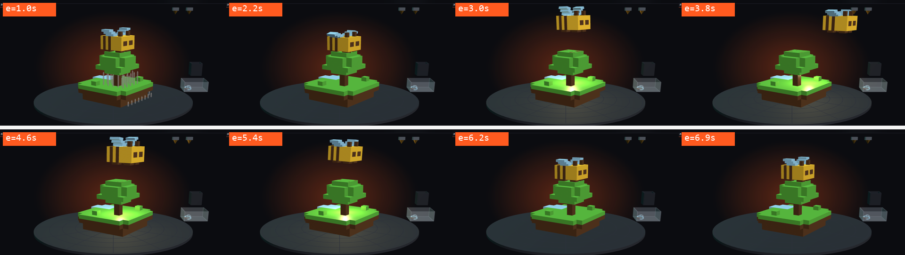
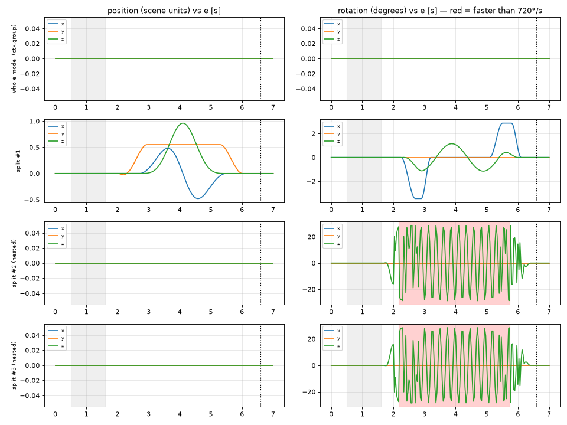

#### Qwen 3.6 · natural thinking
The most movement in space — but look at e=4.9 → 5.1 s: the bee turns ~363° in 0.2 s (red band on the chart,
up to 1636 °/s). It "unwound" its heading because our validator wrongly required rotation exactly 0.
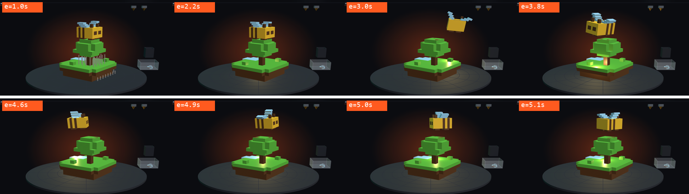
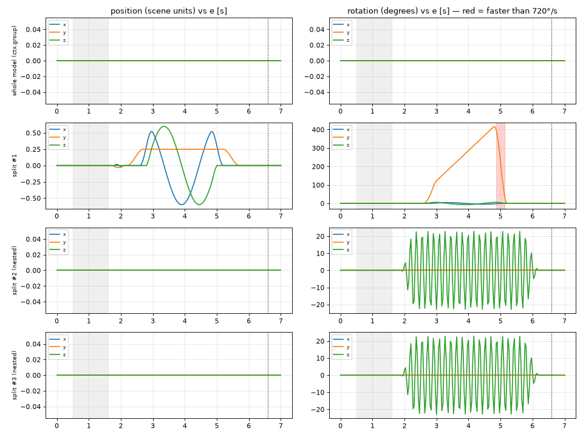

#### Qwen 3.8 · xhigh v2
Good flight; its cut used a margin *below* the bee (`v > 0.706 − 0.012`), so the top faces of the foliage under the bee
flew away with it. Prompt now says: at a contact plane use the exact bound, margins only on free sides.
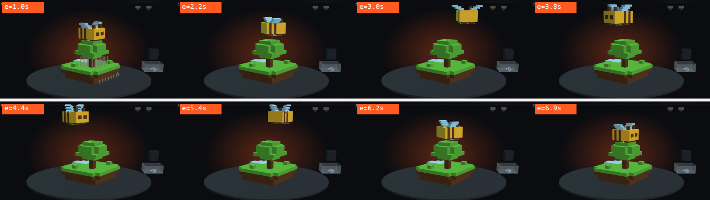
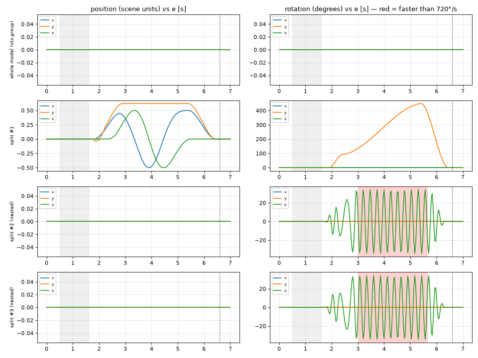

#### Qwen 3.8 · no thinking
Looks right, but the flight is small and timid.
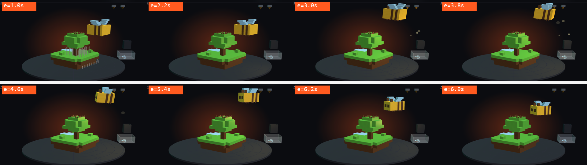
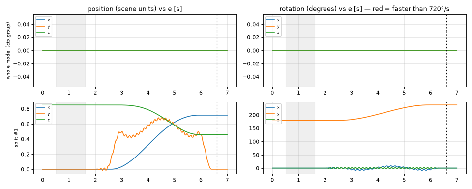

#### Qwen 3.8 · medium + eyes
Round 2 (it looked at the frames): *"the wings flap at ~42 rad/s … it reads as a buzz/spin rather than a deliberate
flap. I'll slow the flap…"* → round 3: `LOOKS_GOOD`. But the chart shows constant x/y during 3–5.5 s: the bee flies out
and turns on the spot — it never circles the tree, which Qwen did not notice.
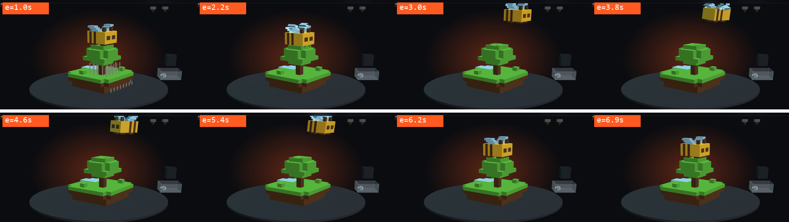
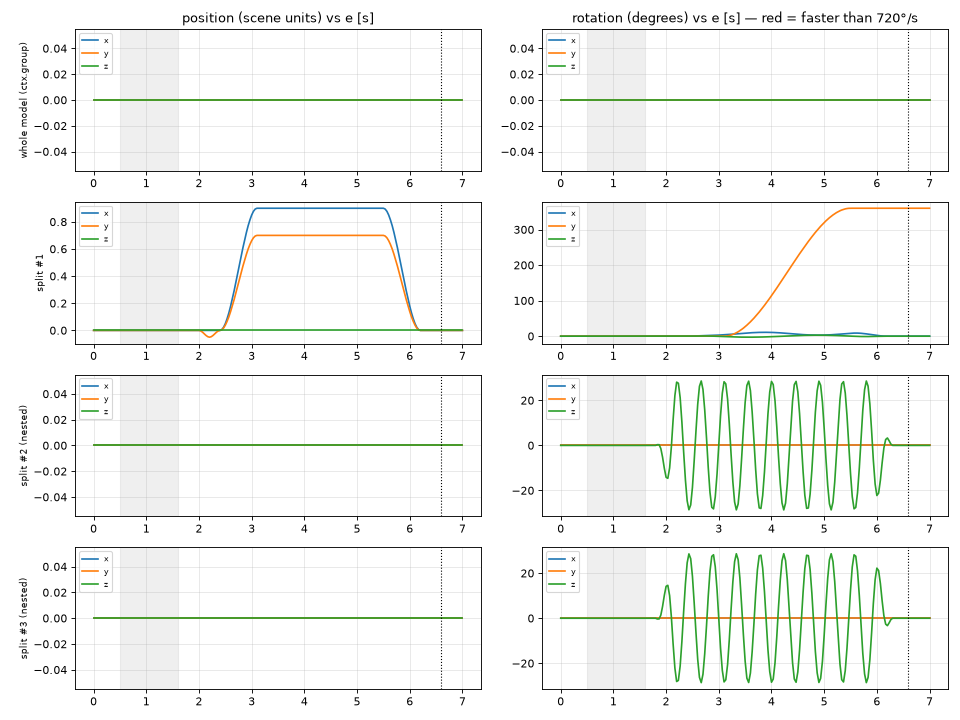

#### Qwen 3.6 · + eyes
*"The wings were rotating out of phase (one up, one down) … I have inverted the rotation of the left wing so both wings
flap in sync."*
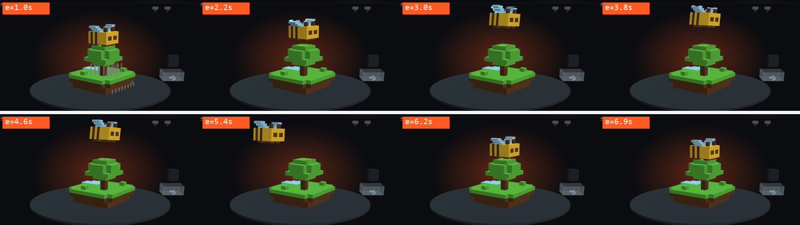
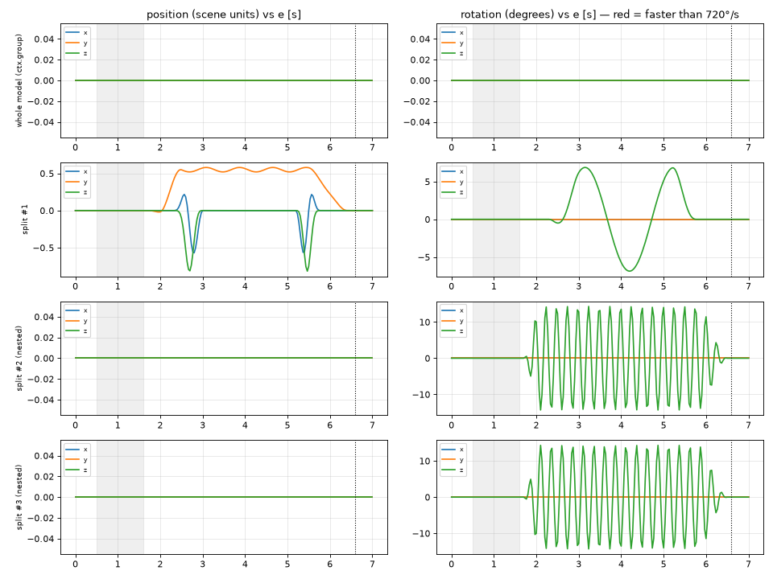

#### Qwen 3.6 · injected low
Moves fairly well; the wings barely move.
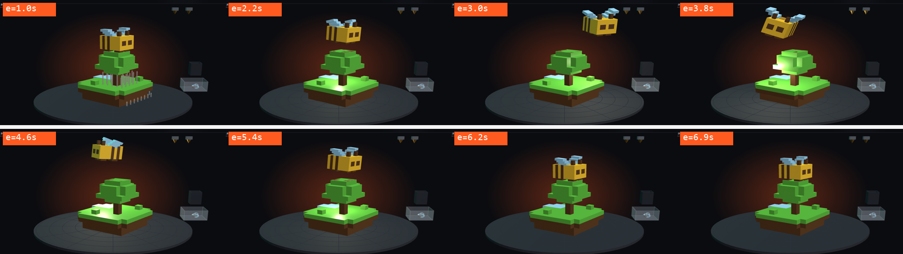
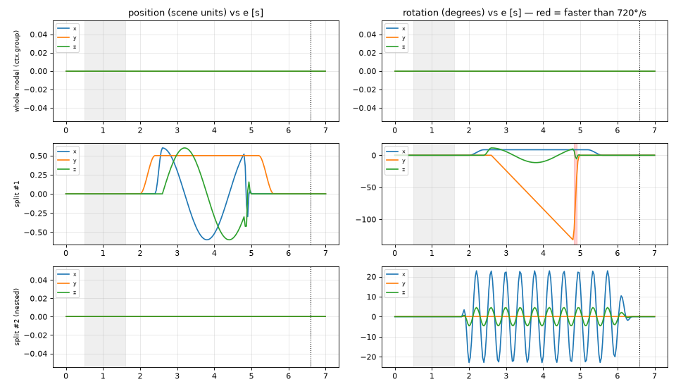

#### Qwen 3.8 · low
Wings twitch: `Math.sin(t * (22 + 14 * lift))` — a frequency that changes with an envelope, multiplied by a large
running time `t`, makes the phase jump. Visible as the irregular oscillation of the nested parts on the chart.
The prompt now forbids it (`sin(t * CONSTANT)`, scale the amplitude instead).
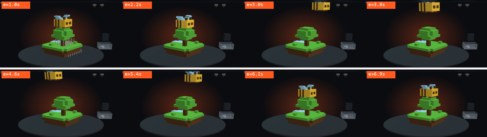
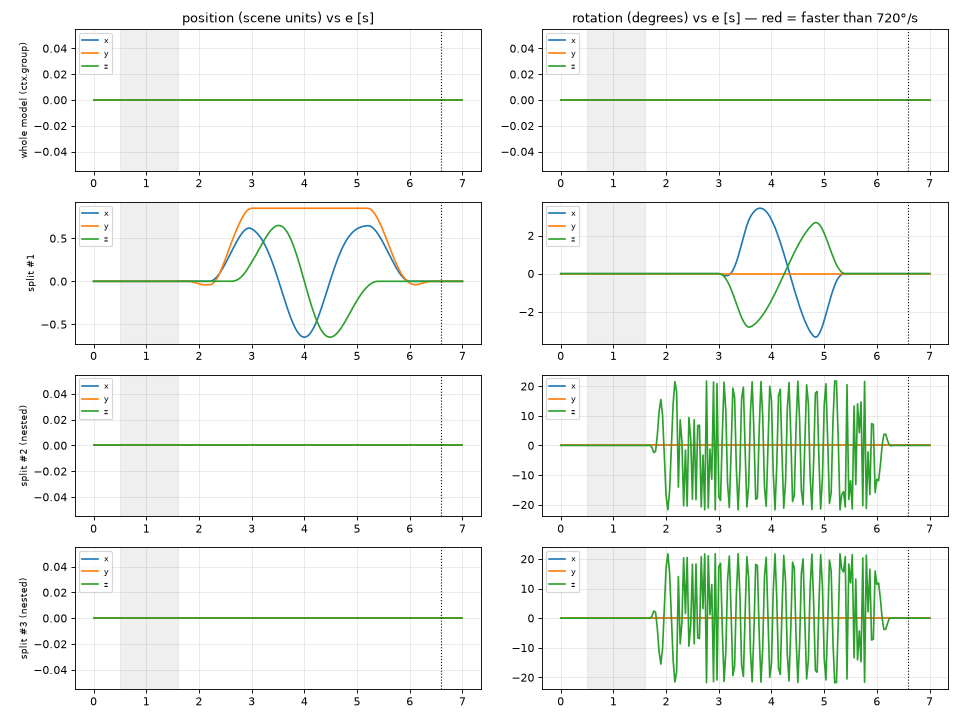

#### Qwen 3.8 · xhigh v3
The wings were cut out of the bee with only `p.u < .35` / `p.u >= .35` (no height limit), so each "wing" is half of the
bee — at e=3.0 s and 4.2 s the bee opens like a book.
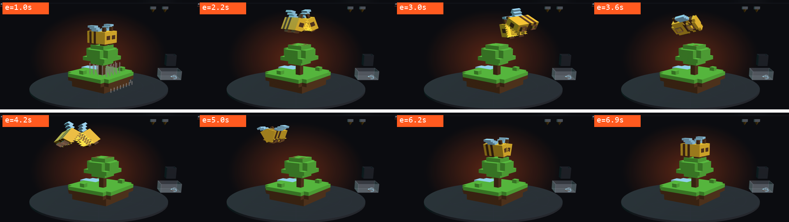
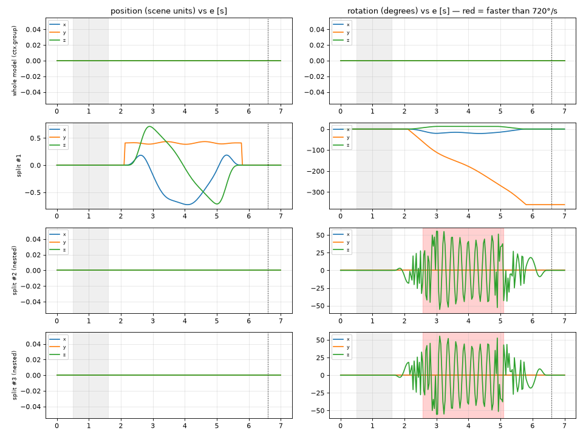

#### Qwen 3.8 · xhigh v1
Before named parts and nested parts existed: the wings (plus a slice of the yellow body) were split separately and fly
beside the bee instead of with it.
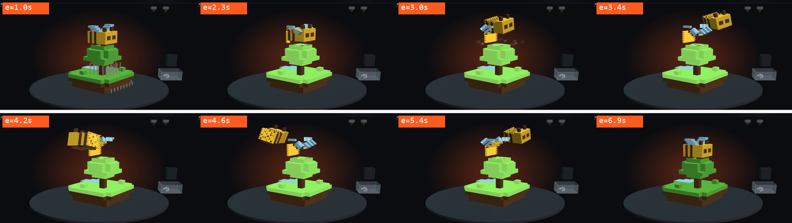
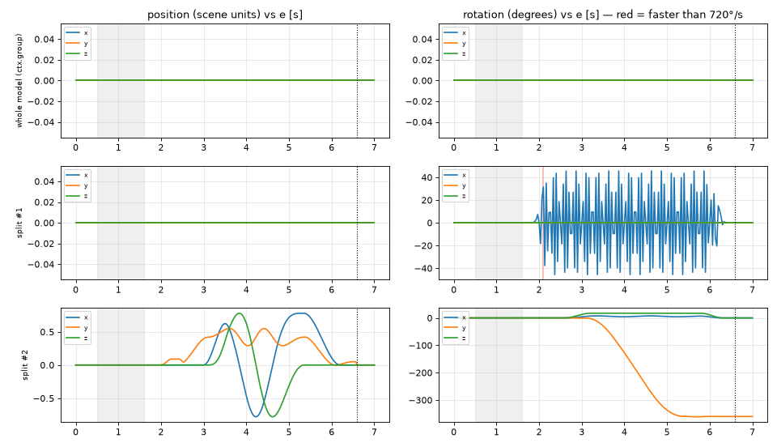

---

## 5. What we learned

1. **Information beats model size.** Named part boxes and nested parts turned the bee from "no model can do it" into
   "every `medium` run succeeds on the first try". Flash-Next (177B) was not better than Qwen 3.8-27B.
2. **`medium` thinking is the sweet spot** for Qwen 3.8. `xhigh` is 2–5× slower and invents shortcuts;
   `low` is fast but careless. Qwen 3.6 has no levels, but an injected "low" sentence does shorten its thinking.
3. **A validator cannot judge looks.** It catches crashes and rule breaks; twitching, timid or unnatural motion needs
   eyes — the owner's, or (partly) the model's own via rendered frames and motion charts.
4. **Check your own host.** Two of the "model mistakes" were our bugs (world-space box on a rotating bed, rotation not
   compared modulo 2π).
5. **Speculative decoding:** always set `--spec-draft-p-min` (~0.65); then long drafts (n7) are fine.
   Compare configurations in the same batch — thinking speed varies ~±5 % between runs.

---

## Repository layout

| Path | What |
|---|---|
| `tools/qwen_anim.py` | generator: facts → LLM → validator → repairs → "eyes" → save |
| `tools/validate.mjs` | validator with real three.js (`--series` for motion data) |
| `tools/look.py`, `tools/capture.mjs`, `tools/serve.py` | "eyes": headless-Chrome frames, motion chart, review message |
| `tools/SYSTEM_PROMPT.md`, `tools/parts.json` | the prompt and named part boxes |
| `tools/run_compare.py`, `tools/make_gallery.py` | comparison runs and this gallery |
| `tools/bench_spec.py`, `results/bench_spec*.json` | speculative-decoding benchmark and raw results |
| `tools/start_qwen38.bat`, `tools/start_qwen36.bat` | final llama-server launchers |
| `host/anim-host-excerpt.js` | the site's side of the animation API |
| `animations/claude/` | Claude's verified examples (robot, rocket) |
| `animations/qwen-bee/` | every Qwen bee variant shown above |
| `images/` | frame sheets and motion charts |

The tools expect the site's folder layout (`models/*.stl`, `models/anims/`, `index.php` with the host API); the site
itself is not included. `npm install` in `tools/` installs `three` and `puppeteer-core` (uses the local Chrome).
